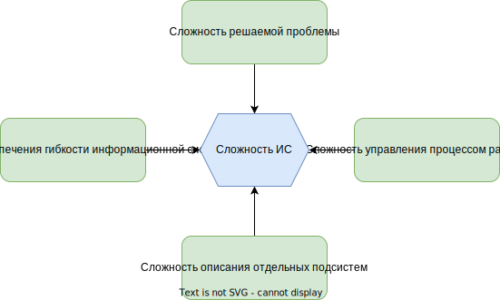

# Глава 2. Сложность информационных систем

### 2.1 Определение системы

*Эмерджентность* - наличие у системы свойств, не присущих её компонентам по отдельности.
Самолет, по определению, "совокупность элементов, каждый из которых по своей природе стремится упасть на землю, но за счет совместных непрерывных усилий преодолевающих эту тенденцию. Он летит только благодаря согласованным усилиям своих компонентов." Гради Буч [1]

*Система* - комбинация взаимодействующих элементов, организованных для достижения одной или нескольких поставленных целей [2].

*Элемент* - естественные или искусственные материальные объекты, а также способы мышления и их результаты (например, формы организации, математические методы, языки программирования).

Как видно из терминологии, система и информационная система в частности, это не только исходный код, но и множество других ключевых элементов. Все информационные системы, даже самые маленькие, создаваемые одним программистом имеют свой жизненный цикл и сложность. У каждой такой системы он свой и как можно управлять сложностью на разных этапах и уровнях и пойдет речь в этой книге.

## 2.2 Почему информационные системы сложны

По словам Ф. Брукса [4] сложность программного обеспечения это скорее необходимость, а не случайность. Брукс выделяет четыре причины по которым информационные систем становятся сложными: *сложность решаемой проблемы*, *управление процессом разработки*, *обеспечение гибкости конечного программного продукта* и *сложность описания отдельных подсистем*.

### 2.2.1 Сложность решаемой проблемы

Информационные системы призваны решать какую-то проблему, которой присуща определенная сложность. К этой сложности добавляется множество различных требований, нередко конфликтующих между собой.

Представьте систему управления самолетом, ее и в общих то чертах описать сложно, не говоря уже о детальном описании. Множество составляющих элементов, создает сложность из-за человеческих ограничений и неоднозначности. Выход из строя с высокой долей вероятности приведет к потере человеческих жизней. Создание такой системы требует самого высокого уровня знаний всех разработчиков. В сумме это нам дает высокую сложность.

У пользователей и разработчиков разные уровни знаний и опыта ("несоответствие импедансов"), из-за этого сами требования и видение могут меняться на протяжении всего жизненного цикла информационной системы. Порой сама базовая сложность настолько велика, что даже заказчики, путем проб и ошибок, должны достичь определенного уровня знаний, чтобы иметь возможность осознать свою истинную потребность и получить возможность рассказать о ней разработчикам. Это приводит к тому, что требования формируются только после того, как заказчик получает работающую систему.

### 2.2.2 Сложность управления процессом разработки

Группа людей занимающихся разработкой информационной системы сама по себе является системой. Каждый человек это элемент системы взаимодействующий с другими людьми для достижения общей цели. Без установки однозначной общей цели такая система становится не управляемой. Людьми в принципе управлять куда сложнее чем программным обеспечением. К человеку нет документации, не известно как он будет действовать в той или иной ситуации, на сколько он совместим с другими людьми в команде. Людям свойственно уставать и быть в плохом настроении, как говорится человеческий фактор никто не отменял. Человек сам по себе сложная система, а управление большим количеством сложных систем, по определению не может быть легким.

Более того, чем больше людей задействовано в работе, тем ниже их средняя производительность. Этот закон был впервые описан Максимилианом Рингельманном.[5] В ИТ этот закон известен как закон Брукса [6] и немного перефразирован "Личная продуктивность отдельных членов группы снижается по мере роста численности группы" и "Если проект не укладывается в сроки, то добавление рабочей силы задержит его ещё больше".

### 2.2.3 Сложность обеспечения гибкости информационной системы

Окружающий мир не стоит на месте, что вынуждает постоянно модифицировать систему под его изменения. Нельзя *однозначно* сказать, что потребуется завтра. Как часто строителям многоквартирных небоскребов в которых уже кипит жизнь, требуется перенести часть квартир вместе с их жителями на другой континент, да так, чтобы они не останавливали свою деятельность и не заметили изменений. В информационных системах не ставится вопрос - "как мы это сделаем, *если* это понадобится", ставится вопрос "как мы это сделаем, *когда* это понадобится".

Еще одной сложностью обеспечения гибкости информационной системы, является слишком большая гибкость в самой культуре и инструментах разработчиков. Строительные компании обычно не занимаются производством необходимых для них компонентов, таких как бетонные плиты, дерево и отделочные материалы. Трудно представить, чтобы перед строительством каждого здания, рядом сначала строились бетонный и деревообрабатывающий завод. Однако в информационных технологиях это обычное дело, как и замена фундамента после строительства. Программисту позволено самостоятельно реализовать собственные компоненты, дизайнеру изобразить собственные фантазии графического интерфейса и так далее. Стандартизация постепенно появляется то тут, то там, однако она довольно скудная и не сильно помогает гибкости.

### 2.2.4 Сложность описания отдельных подсистем

> Как пишет Гради Буч [1] 
> 
> Когда мы кидаем вверх мяч, мы можем довольно надежно предсказать его траекторию, потому что знаем все силы, действующие на него в нормальных условиях. Мы бы очень удивились, если бы, кинув мяч с чуть большей скоростью, увидели, что он на середине пути неожиданно остановился и стремительно рванулся вертикально вверх.
> 
> Внутри большой прикладной программы могут существовать сотни и даже тысячи переменных и несколько способов контроля за ними. Полный список этих переменных, их текущих значений, текущих адресов и стеков описывает состояние прикладной программы в каждый момент времени. Так как исполнение нашей программы осуществляется на цифровом компьютере, мы имеем систему с дискретными состояниями.
> 
   Переходы между дискретными состояниями не могут моделироваться непрерывными функциями. Каждое событие, внешнее по отношению к программной системе, может перевести ее в новое состояние, и, более того, переход из одного состояния в другое не всегда детерминирован. При неблагоприятных условиях внешнее событие может нарушить текущее состояние системы из-за того, что ее создатели не смогли предусмотреть все возможные варианты взаимодействий между событиями.
>  
>  Представим себе пассажирский самолет, в котором система управления полетом и система электроснабжения объединены. Было бы очень неприятно стать свидетелем ситуации, когда результатом нажатия кнопки включения головного света одним из пассажиров, стал бы немедленный ввод самолета в глубокое пикирование. В непрерывных системах такое поведение было бы невозможным, но в дискретных системах любое внешнее событие может повлиять на любую часть внутреннего состояния системы. Это, очевидно, и является главной причиной обязательного тестирования наших систем; но дело в том, что, исключая, возможно, наиболее тривиальные случаи, — всеобъемлющее тестирование таких программ провести невозможно. И пока у нас нет ни математических инструментов, ни интеллектуальных возможностей для полного моделирования поведения больших дискретных систем, при определении ее точности мы должны удовлетвориться существующими уровнями доверия к системе.

Это говорит нам о том, что информационным системам присуща неоднозначность и большая вариативность, иногда даже настолько большая, что ее просто не реально описать и предугадать. Тут, как и в случае гибкости, при разработке мы должны задаваться вопросом не "что делать, *если* это произойдет", а "что делать, *когда* это произойдет" и подготовиться к этому.

### 2.3  Примеры сложных систем
***TODO:***
### 2.4 Роль архитектуры, аналитики и дизайна
***TODO:***

### Дополнительная литература

1. Гради Буч "Объектно-ориентированный анализ и проектирование с примерами приложений".
2. ГОСТ Р ИСО МЭК 15288-2005
3. ГОСТ 58908.1-2020
4. Brooks. No Silver Bullet - Essence and Accident in Software Engineering. 1986.
5. Williams, K. D., Harkins, S., & Latané, B. 1981. Identifiability as a deterrent to social loafing: Two cheering experiments. _Journal of Personality and Social Psychology_, 40: 303—311.
6. The Mythical Man-Month: Essays on Software Engineering